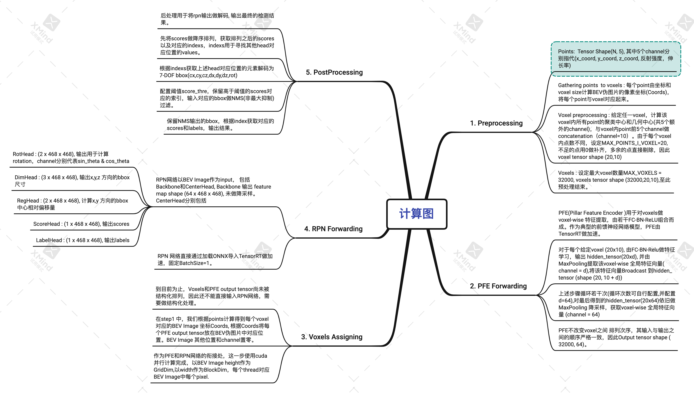

# CenterPoint : An Lidar Object Detection & Tracking project implemented by TensorRT 

The project implement CenterPoint by TensorRT, where CenterPoint is an 3D object detection model using center points in the bird eye view.
Code is written according to the [project](https://github.com/tianweiy/CenterPoint.git)

Besides, it is running inference on [WaymoOpenSet](https://waymo.com/intl/en_us/dataset-download-terms) 


# Setup

The project has been tested on *Ubuntu18.04* and *Ubuntu20.04*, 
It mainly relies on TensorRT and cuda as 3rd-party package,  with the following versions respectively:

*vTensorRT : 8.0.1.6*

*vCuda : 11.3*

This project has provided the baseline onnx models trained with [this config](https://github.com/tianweiy/CenterPoint/blob/master/configs/waymo/pp/waymo_centerpoint_pp_two_pfn_stride1_3x.py) in `models`. If you want to export your own models, we assume you have had [CenterPoint](https://github.com/tianweiy/CenterPoint.git) project installed, you can setup local `det3d` environment 

```
cd /PATH/TO/centerpoint/tools 
bash setup3.sh
```

# Preperation 

###  Export as onnx models
To export your own models, you can run
```
python3 export_onnx.py \
--config waymo_centerpoint_pp_two_pfn_stride1_3x.py \
--ckpt your_model.pth \
--pfe_save_path pfe.onnx \
--rpn_save_path rpn.onnx
```
Here we extract two pure nn models from the whole computation graph---`pfe` and `rpn`, this is to make it easier for trt to optimize its inference engines, 
and we use cuda to connect these nn engines.

###  Generate TensorRT serialized engines
Actually you can directly create trt engines from onnx models and skip this step, however a more ideal way is to load your previously saved serialize engine files.

You can run 
```
python3 create_engine.py \
--config waymo_centerpoint_pp_two_pfn_stride1_3x.py \
--pfe_onnx_path pfe.onnx \
--rpn_onnx_path rpn.onnx \
--pfe_engine_path pfe_fp.engine \
--rpn_engine_path rpn_fp.engine
```
By default this will generate fp16-engine files.

### Work with int8

There are two ways to make quantization according to [Nvidia](https://docs.nvidia.com/deeplearning/tensorrt/developer-guide/#working-with-int8): Explicit  & Implicit Quantization

To make explicit quant, you can go to [TensorRT](https://github.com/NVIDIA/TensorRT)/bin and make 
`./trtexec --onnx=model.onnx --int8 --saveEngine=model.engine`
*you will need to compile tensorrt from source code*

To make implicit quant, you need previously generate calibration files, we assume you have waymo_openset downloaded and have converted into the desired data formation according to [this](https://github.com/tianweiy/CenterPoint/blob/master/docs/WAYMO.md)

```
python3 generate_calib_data.py \
--config waymo_centerpoint_pp_two_pfn_stride1_3x.py \
--ckpt your_model.pth \
--calib_file_path your_calib_files
```

Then refer to the code we provide by 
```
python3 create_engine.py \
--config waymo_centerpoint_pp_two_pfn_stride1_3x.py \
--pfe_onnx_path pfe.onnx \
--rpn_onnx_path rpn.onnx \
--pfe_engine_path pfe_quant.engine \
--rpn_engine_path rpn_quant.engine \
--quant \
--calib_file_path your_calib_files \
--calib_batch_size 10
```

#  Run inference 

After preperation, you may then build tensorrt project by executing the following commands:

```
cd /PATH/TO/centerpoint
mkdir build && cd build
cmake .. && make
```
If you want to create engine from onnx files, you can do infer by
```
./build/centerpoint \
--pfeOnnxPath=models/pfe_baseline32000.onnx \
--rpnOnnxPath=models/rpn_baseline.onnx \
--savePath=results \
--filePath=/PATH/TO/DATA \
--fp16
```
Or load engine files directly 
```
./build/centerpoint \
--pfeEnginePath=pfe_fp.engine \
--rpnEnginePath=rpn_fp.engine \
--savePath=results \
--filePath=/PATH/TO/DATA \
--loadEngine
```
where `filePath` refers to input bin files generated by `tools/generate_input_data.py`


# Computation Speed 
Acceleration is the main aim we want to archieve, and therefore we do most of computation(including preprocess & postprocess) on GPU. 
The below table gives the average computation speed (by millisecond) of every computation module, and it is tested on RTX3080, with all the 39987 waymo validation samples. 
the below table summarizes the computation speed.
||Preprocess|PfeInfer|VoxelAssign|RpnInfer|Postprocess|
|---|---|---|---|---|---|
|fp32+gpupre+gpupost|1.73|8.47|0.36|25.0|2.01|
|fp16+gpupre+gpupost|1.61|5.88|0.17|6.89|2.37|
|fp16+cpupre+gpupost|9.2|6.14|0.42|7.14|2.10|
|int8(minmax)+gpupre+gpupost|1.61|8.23|0.17|5.25|3.21|
|int8(entropy)+gpupre+gpupost|1.41|7.45|0.17|4.65|2.11|
|int8(explicit)+gpupre+gpupost|2.2|8.0|0.17|8.18|2.59|

Note that `fp16` or `int8` may be mixed up with `fp32`, we have no control over which tensor shall be int8, fp16 or fp32, it's dominated by tensorrt. 
We can see that fp16 mode runs much faster than fp32 mode, and gpu preprocess runs much faster than that of cpu, because in cuda, we runs in a pointwise-multithread-way, while in cpu, points are preprocessed in a for-loop-manner. 

# Metrics
You can run `cd tools && python3 waymo_eval.py --cpp_output --save_path ../results ` to compute evaluation metrics, we set score threshould as 0.2, 2D iou threshuold as [0.7,0.5] for vehicle and pedestrian, below we can see the evaluation results:

||Vehicle_level2/mAP|Vehichle_level2/mAPH|vehicle_level2 Recall@0.95|Pedestrian_level2/mAP|Pedestrian_level2/mAPH|Pedestrian_level2 Recall@0.95|
|---|---|---|---|---|---|---|
|fp32+cpupre+cpupost|0.7814|0.7240|0.3966|0.6837|0.5668|0.3739|
|fp32+gpupre+gpupost|0.8039|0.7947|0.5731|0.6723|0.5588|0.2310|
|fp16+gpupre+gpupost|0.8038|0.7945|0.5730|0.6671|0.5541|0.2301|
|int8+gpupre+gpupost|0.5827|0.5615|0.4061|0.0634|0.0456|0.0|


Below is *the old metrics*, it is computed by 3D iou with threshould [0.5,0.5] for vehicle and pedestrian, however the conclusions are the same.

||Vehicle_level2/mAP|Vehichle_level2/mAPH|vehicle_level2 Recall@0.95|Pedestrian_level2/mAP|Pedestrian_level2/mAPH|Pedestrian_level2 Recall@0.95|
|---|---|---|---|---|---|---|
|torchModel|0.6019|0.5027|0.0241|0.5545|0.5377|0.0547|
|fp32+cpupre+gpupost|0.6019|0.5027|0.0241|0.5546|0.5378|0.0548|
|fp16+cpupre+gpupost|0.6024|0.5030|0.0240|0.5545|0.5378|0.0542|
|fp16+gpupre+gpupost|0.6207|0.5173|0.2327|0.5788|0.5624|0.2984|
|int8(minmax)+gpupre+gpupost|0.3470|0.2889|0.0|0.3222|0.3065|0.0|
|int8(entropy)+gpupre+gpupost|0.1396|0.1049|0.0014|0.1550|0.1452|0.0008|
|int8(explicit)+gpupre+gpupost|0.4642|0.3823|0.0288|0.4248|0.4112|0.0201|


From the above metrics, we can see that 
1. fp16 model almostly performs as well as fp32 model, despite it runs much faster.
2. float model+cpupre+gpupost achieves the same result as original torch model, because the way they preprocess points are same, while gpu preprocess performs better. Because points in multithread are orderless, for a voxel that contains more points than given threshould, it makes unbiased subsampling.[detailed reason see here](https://github.com/tianweiy/CenterPoint/issues/243)
3. int8 mode can't achieve the same results as float mode, and implicit calibration performs worse than explicit calib, we choose 1000 samples to make calibration and batch size is set 10, maybe samples are insufficient. However explicit calib model runs slower than implicit ones.

# Online Tracking and Visualization
We use rivz to visualize perception results, to setup catkin workspace, you can go to `tools/catkin_ws`, run
```
bash catkin_make.sh
source devel/setup.bash
```
You need to config your file paths in `tools/catkin_ws/src/waymo_track/src/waymo_track.py`.
Then you can open another two terminals, one type in `roscore`, another one type in `rviz` to show results(you can directly load `default.rviz` in `catkin_ws`), in your original terminal, go to `catkin_ws`, run `rosrun waymo_track waymo_track.py`, you should see the detection or tracking results in rviz window.


Detection & tracking result shows below:
#### float detection & tracking
   

#### implicit quantization & explicit quantization （tracking）

 


# What has been done?
To futher learn the detailed computation graph of CenterPoint, please refer to the following picture.


# Acknowledgements
This project refers to some codes from:


[CenterPoint](https://github.com/tianweiy/CenterPoint)

[TensorRT](https://github.com/NVIDIA/TensorRT/tree/master)

[CenterPoint-PointPillars ](https://github.com/CarkusL/CenterPoint)

[SORT](https://github.com/abewley/sort)

# Contact
Hao Wang by christian.wong423@gmail.com
